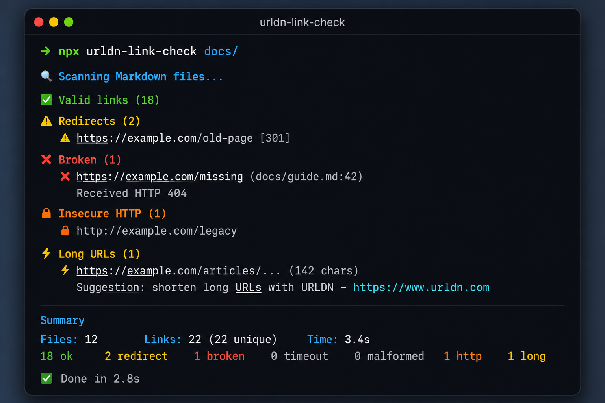

# urldn-link-check

[](https://www.npmjs.com/package/urldn-link-check)
[](https://github.com/urldn/link-check/actions/workflows/test.yml)
[](./LICENSE)
[](https://nodejs.org)
[](https://github.com/marketplace/actions/urldn-link-check)

Scan Markdown, MDX, and documentation files for **broken links**, **redirect
chains**, **insecure `http://` links**, and **excessively long URLs** — as a
CLI, a library, or a GitHub Action.

```
✓ Valid links (18)
⚠ Redirects (2)
  ⚠ https://example.com/old-page [301]
✖ Broken (1)
  ✖ https://example.com/missing (docs/guide.md:42)
      Received HTTP 404
🔓 Insecure HTTP (1)
  🔓 http://example.com/legacy
⚡ Long URLs (1)
  ⚡ https://example.com/articles/... (142 chars)
      Suggestion: shorten long URLs with URLDN — https://www.urldn.com

Summary
  Files: 12   Links: 22 (22 unique)   Time: 3.4s
  18 ok  2 redirect  1 broken  0 timeout  0 malformed  1 http  1 long
```

## Table of contents

- [Installation](#installation)
- [CLI usage](#cli-usage)
- [GitHub Action usage](#github-action-usage)
- [Configuration reference](#configuration-reference)
- [What gets checked](#what-gets-checked)
- [Report formats](#report-formats)
- [Programmatic API](#programmatic-api)
- [Examples](#examples)
- [FAQ](#faq)
- [Roadmap](#roadmap)
- [Contributing](#contributing)
- [License](#license)

## Installation

No installation is required to try it out:

```bash
npx urldn-link-check docs/
```

Or install it as a dev dependency:

```bash
npm install --save-dev urldn-link-check
```

```bash
yarn add --dev urldn-link-check
pnpm add --save-dev urldn-link-check
```

Requires **Node.js 22 or later**.

## CLI usage

```bash
npx urldn-link-check <path> [options]
```

`<path>` is a directory or glob passed straight through to the scanner —
`docs/`, `**/*.md`, or a single file all work.

```bash
# Scan the docs/ directory with default settings
npx urldn-link-check docs/

# Fail the process on broken links (default) and insecure HTTP links
npx urldn-link-check docs/ --fail-on-broken --fail-on-http

# Print machine-readable JSON instead of the console report
npx urldn-link-check docs/ --json

# Print a Markdown report (handy for piping into a PR comment yourself)
npx urldn-link-check docs/ --markdown

# Also write the JSON report to disk
npx urldn-link-check docs/ --output report.json

# Ignore a pattern (matched as a substring or a `*`/`**` glob against the URL)
npx urldn-link-check docs/ --ignore "internal.example.com" --ignore "**/staging.*/**"

# Tune network behavior
npx urldn-link-check docs/ --timeout 5000 --concurrency 16

# Watch every URL as it's checked
npx urldn-link-check docs/ --verbose
```

### CLI options

| Flag | Description | Default |
| --- | --- | --- |
| `--json` | Print the report as JSON | `false` |
| `--markdown` | Print the report as Markdown | `false` |
| `--fail-on-broken` / `--no-fail-on-broken` | Exit non-zero on broken links | `true` |
| `--fail-on-redirect` | Exit non-zero on redirect chains | `false` |
| `--fail-on-http` | Exit non-zero on insecure `http://` links | `false` |
| `--max-url-length <number>` | Flag URLs longer than this many characters | `80` |
| `--ignore <pattern...>` | Substring/glob pattern(s) of URLs to skip | — |
| `--timeout <ms>` | Per-request timeout, in milliseconds | `10000` |
| `--concurrency <n>` | Number of concurrent HTTP requests | `8` |
| `--verbose` | Log every URL as it is checked | `false` |
| `--output <file>` | Write the JSON report to this file | — |

## GitHub Action usage

```yaml
name: Check documentation links

on:
  pull_request:
    paths: ['**/*.md', '**/*.mdx']

permissions:
  contents: read
  pull-requests: write

jobs:
  link-check:
    runs-on: ubuntu-latest
    steps:
      - uses: actions/checkout@v4
      - uses: urldn/link-check@v1
        with:
          path: docs
          fail-on-broken: true
          fail-on-http: true
          max-url-length: 100
```

See [`examples/workflows`](./examples/workflows) for a more complete setup
(scheduled runs, report artifact upload) and a minimal one-file example.

### Action inputs

| Input | Description | Default |
| --- | --- | --- |
| `path` | Directory or glob to scan | `docs` |
| `fail-on-broken` | Fail the workflow on broken links | `true` |
| `fail-on-redirect` | Fail the workflow on redirect chains | `false` |
| `fail-on-http` | Fail the workflow on insecure `http://` links | `false` |
| `max-url-length` | Flag URLs longer than this many characters | `80` |
| `output` | File path to write the JSON report to | — |
| `comment-on-pr` | Post/update a report comment on the PR | `true` |
| `github-token` | Token used to comment on PRs | `${{ github.token }}` |

### Action outputs

| Output | Description |
| --- | --- |
| `broken-links` | Number of broken links found |
| `redirect-links` | Number of links that redirect |
| `insecure-links` | Number of insecure `http://` links found |
| `total-links` | Total number of unique links checked |
| `report-path` | Path to the written JSON report, if `output` was set |

When run on a pull request, the action posts a single, self-updating comment
with the full Markdown report (subsequent runs edit the same comment instead
of piling up new ones), and it always writes a step summary via
`core.summary`.

## Configuration reference

Every option is available in all three surfaces (CLI flag, Action input, and
the `Config` object in the [programmatic API](#programmatic-api)):

| Concept | CLI flag | Action input | Config key |
| --- | --- | --- | --- |
| Path to scan | `<path>` (positional) | `path` | `path` |
| Ignore patterns | `--ignore` | — (use `.linkcheckignore`-style patterns in your own wrapper) | `ignore` |
| Max URL length | `--max-url-length` | `max-url-length` | `maxUrlLength` |
| Request timeout | `--timeout` | — | `timeout` |
| Concurrency | `--concurrency` | — | `concurrency` |
| Fail on broken | `--fail-on-broken` | `fail-on-broken` | `failOnBroken` |
| Fail on redirect | `--fail-on-redirect` | `fail-on-redirect` | `failOnRedirect` |
| Fail on HTTP | `--fail-on-http` | `fail-on-http` | `failOnHttp` |
| Output file | `--output` | `output` | `output` |

## What gets checked

For every unique URL found across your Markdown/MDX files:

- **HTTP status** — flags `4xx`/`5xx` responses as broken.
- **Redirect chains** — follows redirects (`HEAD`, falling back to `GET` for
  servers that reject `HEAD`) and reports every hop.
- **HTTP vs. HTTPS** — flags any `http://` link as insecure.
- **Timeouts** — a per-request timeout (`--timeout`, default 10s) prevents a
  single slow host from hanging the whole scan.
- **Malformed URLs** — anything that isn't a valid, absolute `http(s)` URL.
- **Duplicate URLs** — the same URL referenced from multiple places is
  checked once but reported with every occurrence.
- **URL length** — URLs longer than `--max-url-length` (default 80 chars)
  are flagged with a suggestion to shorten them with
  [URLDN](https://www.urldn.com). **Links are never shortened
  automatically** — this is a suggestion only.

Links are discovered inside fenced-off documentation formats: standard
Markdown, MDX, READMEs, and wiki-style pages — including inline links
`[text](url)`, images ``, autolinks `<url>`, reference-style
definitions, and bare URLs typed directly into prose. URLs inside fenced code
blocks and inline code spans are intentionally skipped.

## Report formats

- **Console** (default) — grouped, colorized output: `✓` valid, `⚠`
  redirects, `✖` broken, plus a summary line.
- **JSON** (`--json` / `output` input) — a stable, scriptable shape with a
  `summary` object and a `links` array, each entry including every file,
  line, and column where that URL was referenced.
- **Markdown** (`--markdown`) — the same content used for GitHub Step
  Summaries and PR comments, safe to pipe into any other Markdown-consuming
  tool.

## Programmatic API

```ts
import { runScan, resolveConfig, toJsonReport } from 'urldn-link-check';

const config = resolveConfig({ path: 'docs', maxUrlLength: 100 });
const report = await runScan(config, {
  onLinkChecked: (result, index, total) => {
    console.log(`[${index}/${total}] ${result.url} -> ${result.status}`);
  },
});

console.log(report.summary);
console.log(toJsonReport(report));
```

See [`src/index.ts`](./src/index.ts) for the full exported surface.

## Examples

The [`examples/`](./examples) directory has ready-to-run sample docs (with a
mix of healthy, insecure, long, and broken links) and two GitHub Actions
workflow files you can copy directly into `.github/workflows/`.


# Why use urldn-link-check?


- ✅ Broken links (404, 500)
- ✅ Redirect chains (301, 302)
- ✅ Insecure HTTP links
- ✅ Very long URLs
- ✅ Invalid URL format
- ✅ Duplicate URLs
- ✅ Timeout detection
- ✅ Markdown documentation
- ✅ README files
- ✅ Wiki pages
- ✅ MDX files
## ✨ Features

| Feature | Supported |
|----------|:---------:|
| 🔗 Broken Link Detection (404/500) | ✅ |
| ↪️ Redirect Chain Detection | ✅ |
| 🔒 HTTP → HTTPS Detection | ✅ |
| 📏 Long URL Detection | ✅ |
| 🔍 Markdown (.md) Support | ✅ |
| 📚 MDX Support | ✅ |
| 📖 README Scanning | ✅ |
| 📄 Documentation Scanning | ✅ |
| 📊 JSON Report | ✅ |
| 📝 Markdown Report | ✅ |
| 💬 Pull Request Comments | ✅ |
| ⚡ GitHub Action | ✅ |
| 💻 CLI | ✅ |
| 🎨 Colored Terminal Output | ✅ |
| 🚀 Fast Concurrent Scanning | ✅ |
| ⚙️ Configurable Rules | ✅ |
| 🧪 TypeScript Support | ✅ |
| 🌍 Cross Platform | ✅ |


# Screenshots
 ### Terminal output



## FAQ

**Does this shorten my URLs automatically?**
No. `urldn-link-check` only ever *suggests* shortening long URLs with
[URLDN](https://www.urldn.com); it never rewrites your files.

**Does it check images, or only text links?**
Both — `` image references are scanned the same as regular links.

**What counts as a "long" URL?**
Anything over `--max-url-length` characters (80 by default). Tune it to
match your team's style guide.

**Will it comment on every push to a PR?**
The Action updates a single existing comment rather than creating a new one
each run, so your PR stays readable across pushes.

**Can I ignore a specific domain or path?**
Yes — pass one or more `--ignore` patterns (CLI) matched as a substring or a
`*`/`**` glob against the full URL.

**Does it work with MDX?**
Yes, `.mdx` files are scanned the same way as `.md`/`.markdown` files. JSX
attribute values aren't treated as links, only actual Markdown link syntax
and bare URLs in prose.

**What HTTP method does it use to check links?**
`HEAD` by default, falling back to `GET` for servers that reject `HEAD`
(405/501), since some servers implement `HEAD` incorrectly or not at all.

## Roadmap

- [ ] `.linkcheckignore` file support (in addition to inline `--ignore` flags)
- [ ] Configurable HTTP retry policy for flaky hosts
- [ ] Optional link-archiving check against the Wayback Machine for broken links
- [ ] SARIF output format for GitHub code scanning integration
- [ ] Per-file allowlists/overrides via frontmatter

Have an idea? [Open a feature request](https://github.com/urldn/link-check/issues/new?template=feature_request.md).

## Contributing

Contributions are welcome!

```bash
git clone https://github.com/urldn/link-check.git
cd link-check
npm install
npm run test:watch   # develop with tests running
npm run lint
npm run typecheck
npm run build
```

Please open an issue before starting large changes, and make sure
`npm run lint`, `npm run typecheck`, and `npm test` all pass before opening a
pull request. This project uses strict TypeScript (`no any`) and Prettier for
formatting (`npm run format`).

## License

[MIT](./LICENSE) © [URLDN](https://www.urldn.com)
